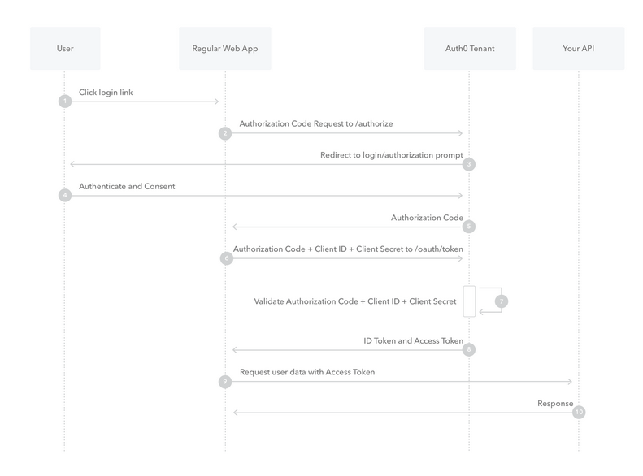

# Code Fellows 301

## Class 15

### What is OAuth

- What is OAuth?

"OAuth is an open-standard authorization protocol or framework that describes how unrelated servers and services can safely allow authenticated access to their assets without actually sharing the initial, related, single logon credential. In authentication parlance, this is known as secure, third-party, user-agent, delegated authorization."

- Give an example of what using OAuth would look like.

Authorizing a user login.

- How does OAuth work? What are the steps that it takes to authenticate the user?

This is a long part, so I copied it from the referenced site below:

    1. The first website connects to the second website on behalf of the user, using OAuth, providing the user’s verified identity.
    2. The second site generates a one-time token and a one-time secret unique to the transaction and parties involved.
    3. The first site gives this token and secret to the initiating user’s client software.
    4. The client’s software presents the request token and secret to their authorization provider (which may or may not be the second site).
    5. If not already authenticated to the authorization provider, the client may be asked to authenticate. After authentication, the client is asked to approve the authorization transaction to the second website.
    6. The user approves (or their software silently approves) a particular transaction type at the first website.
    7. The user is given an approved access token (notice it’s no longer a request token).
    8. The user gives the approved access token to the first website.
    9. The first website gives the access token to the second website as proof of authentication on behalf of the user.
    10. The second website lets the first website access their site on behalf of the user.
    11. The user sees a successfully completed transaction occurring
    12. OAuth is not the first authentication/authorization system to work this way on behalf of the end-user. In fact, many authentication systems, notably Kerberos, work similarly. What is special about OAuth is its ability to work across the web and its wide adoption. It succeeded with adoption rates where previous attempts failed (for various reasons).

- What is OpenID?

OpenId is about authentication and is about logging a human into a machine where OAuth is more about machines logging into machines for humans.

[Reference](https://www.csoonline.com/article/3216404/what-is-oauth-how-the-open-authorization-framework-works.html)

### Auth Flows

- What is the difference between authorization and authentication?

In simple terms, authentication is the process of verifying who a user is, while authorization is the process of verifying what they have access to.

- What is Authorization Code Flow?

- What is Authorization Code Flow with Proof Key for Code Exchange (PKCE)?

"During authentication, mobile and native applications can use the Authorization Code Flow, but they require additional security. Additionally, single-page apps have special challenges. To mitigate these, OAuth 2.0 provides a version of the Authorization Code Flow which makes use of a Proof Key for Code Exchange (PKCE)."

- What is Implicit Flow with Form Post?

"Implicit Flow with Form Post flow uses OIDC to implement web sign-in that is very similar to the way SAML and WS-Federation operates. The web app requests and obtains tokens through the front channel, without the need for secrets or extra backend calls. With this method, you don’t need to obtain, maintain, use, and protect a secret in your application."

- What is Client Credentials Flow?

"Instead, M2M apps use the Client Credentials Flow (defined in OAuth 2.0 RFC 6749, section 4.4), in which they pass along their Client ID and Client Secret to authenticate themselves and get a token."

- What is Device Authorization Flow?

"With input-constrained devices that connect to the internet, rather than authenticate the user directly, the device asks the user to go to a link on their computer or smartphone and authorize the device. This avoids a poor user experience for devices that do not have an easy way to enter text. To do this, device apps use the Device Authorization Flow (ratified in OAuth 2.0), in which they pass along their Client ID to initiate the authorization process and get a token."

- What is Resource Owner Password Flow?

"Though we do not recommend it, highly-trusted applications can use the Resource Owner Password Flow (defined in OAuth 2.0 RFC 6749, section 4.3), which requests that users provide credentials (username and password), typically using an interactive form. Because credentials are sent to the backend and can be stored for future use before being exchanged for an Access Token, it is imperative that the application is absolutely trusted with this information."

[Reference](https://auth0.com/docs/get-started/authentication-and-authorization-flow)

[HOME PAGE](https://getullrichordietrying.github.io/reading-notes/)
