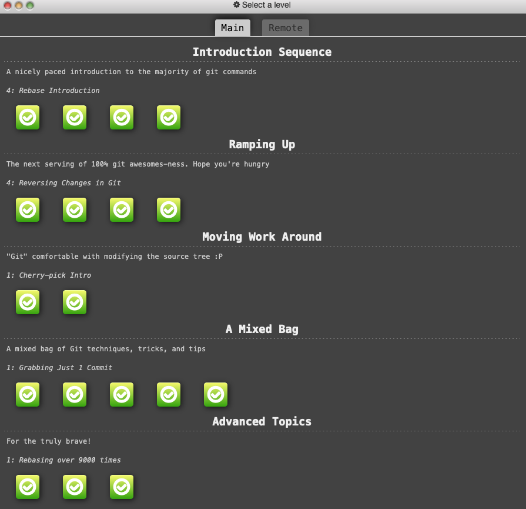
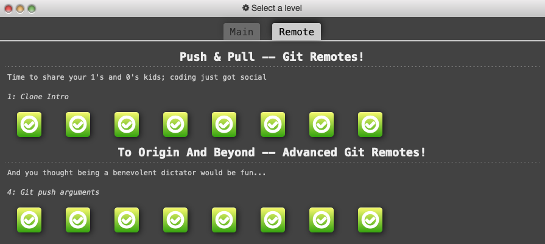

# Code Fellows 401 JavaScript

## GIT

- Most of this was review, but the advanced concepts were not very familiar, so this was a great intro and practice. I feel pretty comfortable doing most git operations, but moving around trees as described in the advanced section felt pretty new.

### GIT Results

[HOME PAGE](https://getullrichordietrying.github.io/reading-notes/)
