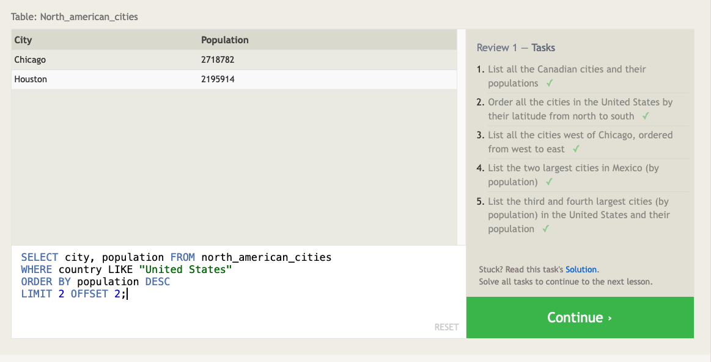

# Code Fellows 401 JavaScript

## SQL

- I was working with relational databases in different CRMs, and importing those values into different databases. When I was doing that, I was just using a GUI to filter and manipulate data. Now I have a better understanding of what was going on behind the scenes, and how I could have better managed that data.
- Easy to think of when comparing carious spreadsheets for relational data.

### SQL Bolt Results

---

[HOME PAGE](https://getullrichordietrying.github.io/reading-notes/)
