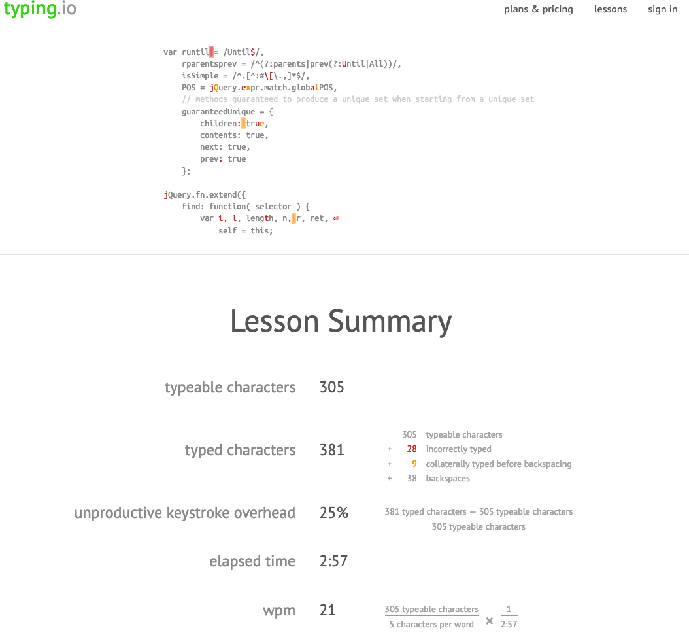
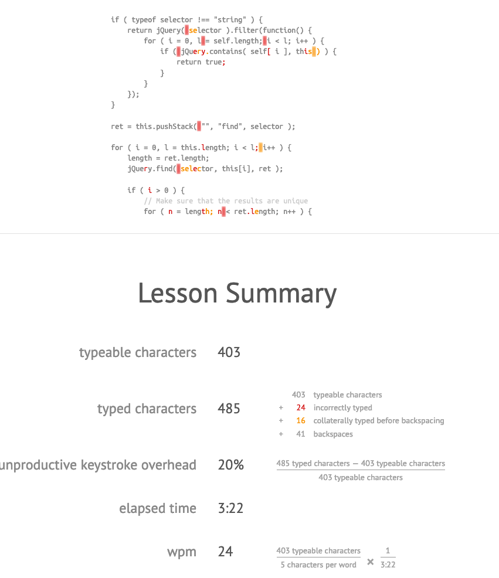
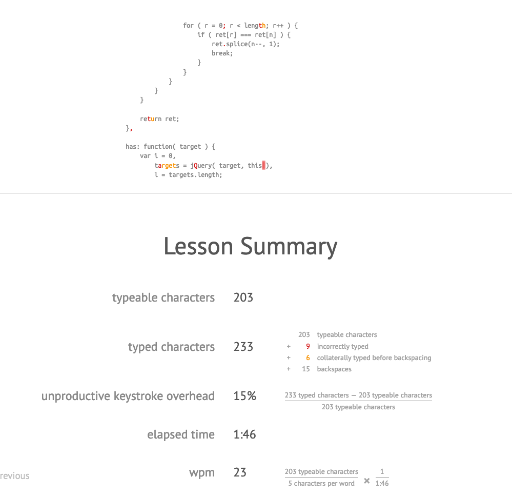

# Code Fellows 401 JavaScript

## Typing

- I know I make quite a few errors and backspace while I type in general, but I think it was somewhat exaggerated by the fact that I am not actually typing naturally when I am just copying something. That being said, I should be able to copy something without so many errors. Again, I think the context exaggerates things quite a bit. I will definitely come to revisit some of this because they are definitely helpful practice.
- I taught myself how to type when I was playing runescape 20 years ago, and my style has never been amended. It seems to work alright for me though.

### Typing Results

---

[HOME PAGE](https://getullrichordietrying.github.io/reading-notes/)
